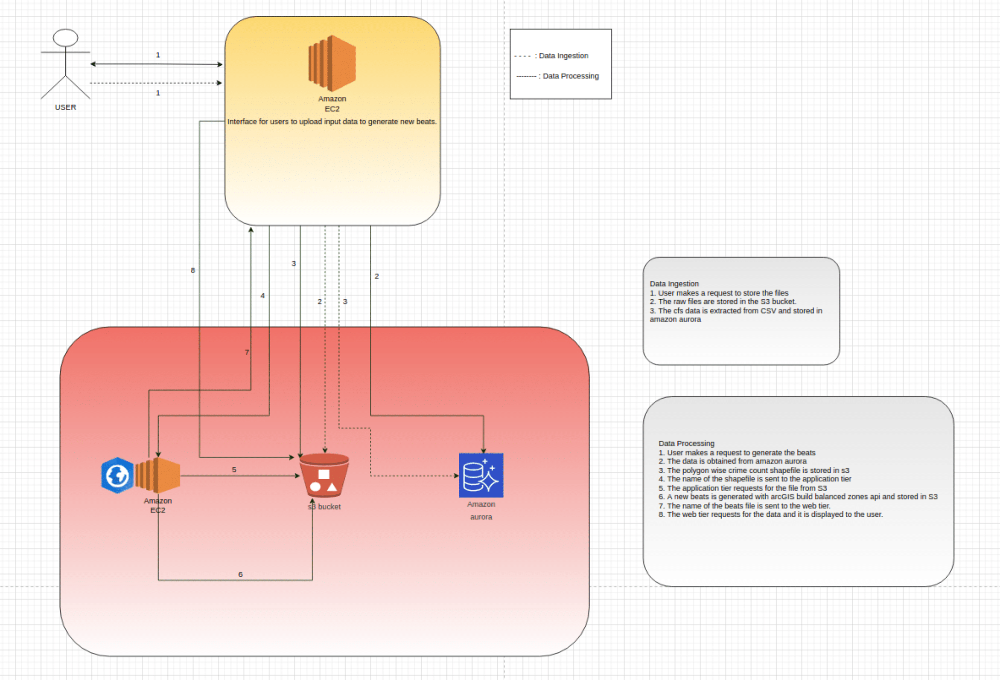
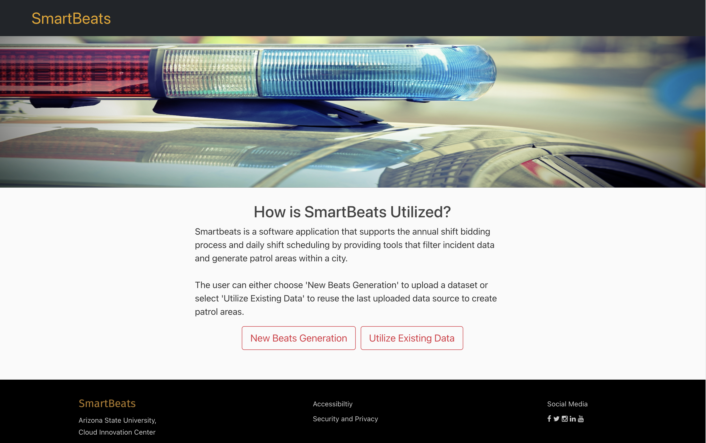
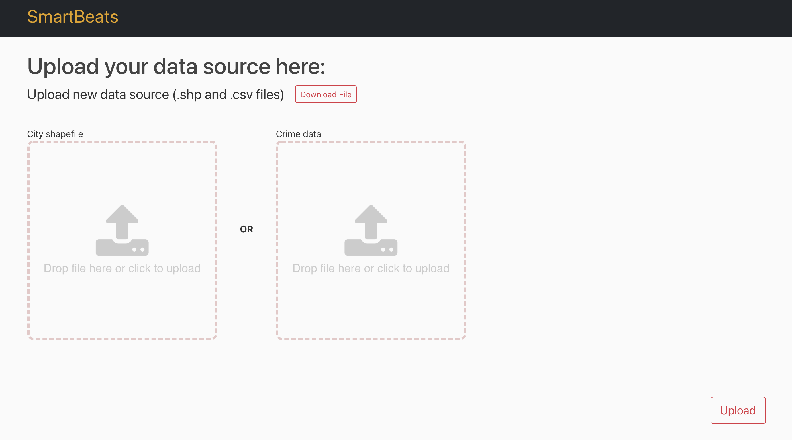
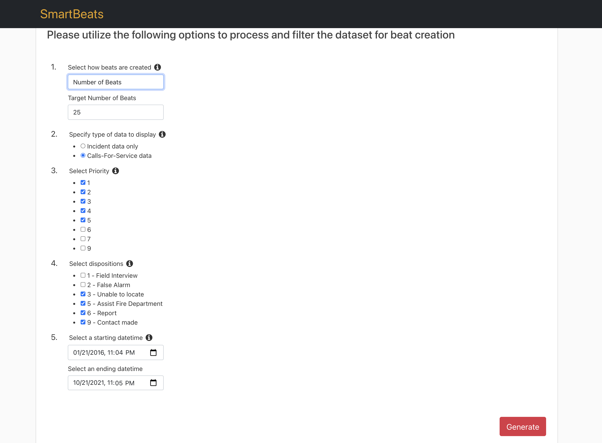

# Smartbeats

|Index| Description|
|:----------------|:-----------|
| [Overview](#overview)         |     See the motivation behind this project.    | 
| [Description](#description)         |     Learn more about the problem, implemented solution and challenges faced.    | 
| [Installation Guide](#installation-guide)         |    How to install Smartbeats architecture. |
| [How to Use](#how-to-use)       |     Instructions to use Smartbeats.   |
| [Credits](#credits)      |     Meet the team behind this.     |
| [License](#license)      |     License details.     |

# Overview
The [Arizona State University Smart City Cloud Innovation Center Powered by AWS](https://smartchallenges.asu.edu/) (ASU CIC) recently collaborated with the [City of Glendale, Arizona](https://www.glendaleaz.com/) to improve the process for designing and maintaining patrol areas.

Glendale aims to be able to provide a safe and timely response to calls for service. Today this process is done manually and relies on the personal knowledge of those who make the schedule and can be time consuming if an officer must take a sudden leave of absence and the scheduler must make several calls in order to find a replacement. This process can evolve with SmartBeats, a cloud-based service that can assist in scheduling police patrol areas.

# Description

## Problem
Each year the Glendale Police Department updates their patrol beats in order to improve response times and ensure that resources are placed where they are needed. As Glendale grows and changes, the needs of the community change. One area may have higher rates of traffic than it did last year, slowing down response time, or something else may have changed that makes it harder for Glendale Police to serve their community. This year they approached the Arizona State University Smart City Cloud Innovation Center (ASU CIC) for a solution in restructuring the beats. The ASU CIC seeks to build a solution that produces beat schedules that optimize response time and puts resources that are needed.

## Approach
Using data analytics, the ASU CIC will produce SmartBeats, a cloud-based software prototype that takes into account factors such as calls-for-services, incident information, disposition data and more in order to create optimal options for police schedules and beats. SmartBeats will help optimize schedules in less than optimal conditions, such as when an officer is out on leave. It can also help officers accomplish the department goal of spending a third of their time responding to calls, another third doing administrative tasks, and the final third being available and engaging with their community. The goal is to ensure a safe and timely response, provide more resources to communities, and increase community engagement to build better relationships with the community.

## Architecture Diagram

## Functionality

The functionality of Smartbeats is divided into two services:

### 1. Data Ingestion Service
Smartbeats require two input files to generate beats: 
1. City shapefile which contains City area divided into neighborhoods/polygons
2. Crime data in .csv format (We'll also provide the exact format of all required columns)

### 2. Spatial Data Processing Service
The user can generate beats by utilizing the following filtering options:

1. Beat creation criteria:
    1. Calls For Service: Specify the approximate count of Calls-for-service (911 calls) per beat
    2. Number of Beats: Specify the exact number of beats to divide the city into

2. Type of data to use (Calls-for-service/Incident data)
   1. Calls-For-Service data: 911 call received by the Police Department. Utilize all Calls-For-Service data to generate beats.
   2. Incident data only: Subset of Calls-For-Service data (911 calls) that end up getting registered is called an incident. Utilize incident data to generate beats.
3. Priority: Every Call-For-Service has an associated priority within range [Highest Priority=1, Lowest Priority=9].
    > User can configure prioriy values in `settings.py` config file of web-tier.
4. Dispositions: Disposition is the final status of the call
    > User can configure Disposition values in `settings.py` config file of web-tier
5. Start date and time: Specify starting date and time
6. End date and time: Specify ending date and time

## Technologies
Smartbeats is developed using a microserivce based architecture. It has two components, a web-tier and an app-tier. The web-tier hosts the frontend and the data ingestion service. The app-tier runs ArcGIS Pro for spatial data processing and generating beats.

We have used the following technologies to develop the application:

### Web-Tier
1. Python + [Django](https://www.djangoproject.com/): Application Development
2. [Amazon S3](https://aws.amazon.com/s3/): To store crime .csv and city shapefile
3. [Amazon Aurora](https://aws.amazon.com/rds/aurora/): To store data in crime .csv file
4. [Amazon EC2](https://aws.amazon.com/ec2/): Deployment of web-tier
5. [Pandas](https://pandas.pydata.org/): Data preprocessing
6. [GeoPandas](https://geopandas.org/): Spatial joins and geo-processing
7. [Folium](https://python-visualization.github.io/folium/): Visualization of generated beats map

### App-Tier
1. Python + [Flask](https://flask.palletsprojects.com/en/2.0.x/): Application Development
2. [Amazon S3](https://aws.amazon.com/s3/): To store beats shapefile
3. [ArcGIS Pro](https://pro.arcgis.com/en/pro-app/latest/get-started/get-started.htm): Spatial data processing
4. [Amazon EC2](https://aws.amazon.com/ec2/): Windows EC2 to host ArcGIS Pro and deploy App server

<!-- ## Challenges
1. To generate the exact  -->

## Assumptions
1. We have provided the sample [Crime csv](https://github.com/ASUCICREPO/smart-beats/blob/master/web-tier/beats/static/beats/example.csv) file that is required to generate beats. We are expecting the input file to be in the exact format and contain following columns:
   1. `event_number`:  Call-For-Service ID. **Note: Every value must be unique**
   2. `priority`: Every Call-For-Service has an associated priority within range [Highest Priority=1, Lowest Priority=9]
   3. `address`: Address from where Call-For-Service was recieved
   4. `is_incident`: Was the Call-For-Service registered as an incident or not
   5. `geometry_wkt`: Point Geometry coordiante of Call-For-Service
   6. `timestamp`: Timestamp when Call-For-Service was recorded
   7. `disposiiton`: The final status of Call-For-Service
2. The Crime csv and the City shapefile must belong to the same city.
3. Our application will not perform Geo-coding (the process of converting addresses into geographic coordinates). It has to be done on user end to create Crime csv file.
4. We are using ArcGIS Pro: buildBalancedZones() API in the backend. The user must have an active ArcGIS Pro subscription in the application server.
5. All spatial components (Geometry) like Points and Polygons in the input files (City shapefile + Crime csv) must have `epsg:4326`

## Future Enhancements
1. Overlaying beats map with real time police officer location information
2. Real-time manual manipulation of the generated Beats map
3. Include more beat generation parameters
4. Utilize ArcGIS Pro server licensing to scale app-tier
5. Deploy application on AWS Beanstalk (PaaS) or AWS Lambda (FaaS)
6. Create an email notification service to notify the user when the beat generation process is complete
7. Store history of generated beats
8. Color coding beats based on incident resolution data.
9. Use information such as phone calls, traffic data and CCTV footage to analyze and generate better beats.

# Deployment Guide
1. [Application server installation guide](https://github.com/ASUCICREPO/smart-beats/blob/master/app-tier/README.md)
2. [Web server installation guide]([./web-tier/README.md](https://github.com/ASUCICREPO/smart-beats/blob/master/web-tier/README.md))

# How to use
1. Home page
    
    

2. Click on **New Beats Generation** on home page to upload new city shapefile and crime data
 
    

3. Click on **Utilize Existing Data** on home page to generate beats from previously uploaded data

4. Fill in the parameters to create beats and click on Generate

   1. **Select how beats are created**
       1. **Calls For Service**: Specify the approximate count of Calls-for-service (911 calls) per beat
       2. **Number of Beats**: Specify the exact number of beats to divide the city into

   2. **Specify type of data to display**
      1. **Calls-For-Service data**: 911 call received by the Police Department. Utilize all Calls-For-Service data to generate beats.
      2. **Incident data only**: Subset of Calls-For-Service data (911 calls) that end up getting registered is called an incident. Utilize incident data to generate beats.
   3. **Select Priority**  
        Every Call-For-Service has an associated priority within range [Highest Priority=1, Lowest Priority=9].
   4. **Select dispositions**  
    Disposition is the final status of the call
   5. **Select a starting datetime**  
      Specify starting date and time
   6. **Select an ending datetime**  
      Specify ending date and time

    

5. Get a fully responsive dynamic Beats map as result
   
    

# Credits

"Smartbeats" is an open source software. The following people have contributed to this project.

**Developers:**  
[Risabh Raj](https://www.linkedin.com/in/risabh-raj/)  
[Sameet Kumar](#)

**UI Designer:** [Sarah Vue](#)

**Program Manager, AWS:**  [Jubleen Vilku](#)

**Digital Innovation Lead, AWS:** [Jason Whittet](#)

**General Manager, ASU:** [Ryan Hendrix](#)

This project was designed and developed with guidance and support from the [ASU Cloud Innovation Center](https://smartchallenges.asu.edu/) and the [City of Glendale, Arizona](https://www.glendaleaz.com/) teams. 

# License
This project is distributed under the [Apache License 2.0](https://github.com/ASUCICREPO/smart-beats/blob/master/LICENSE)
